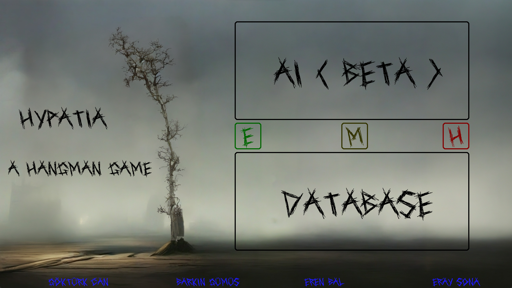
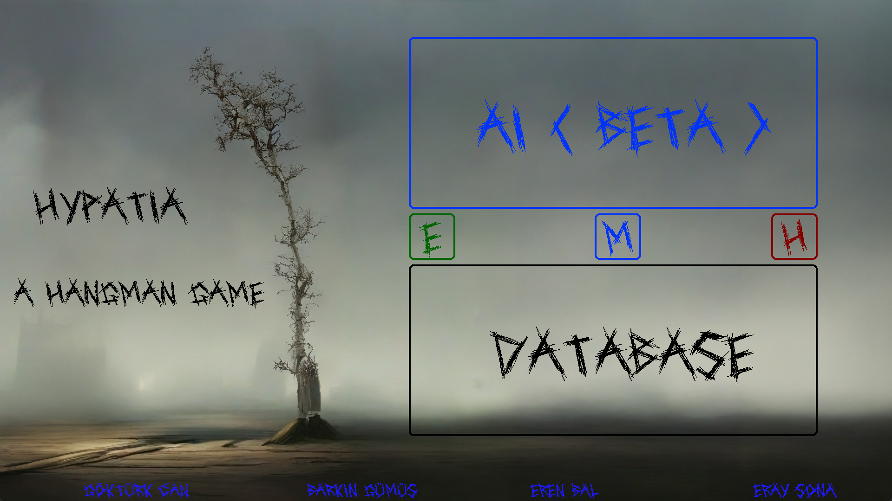
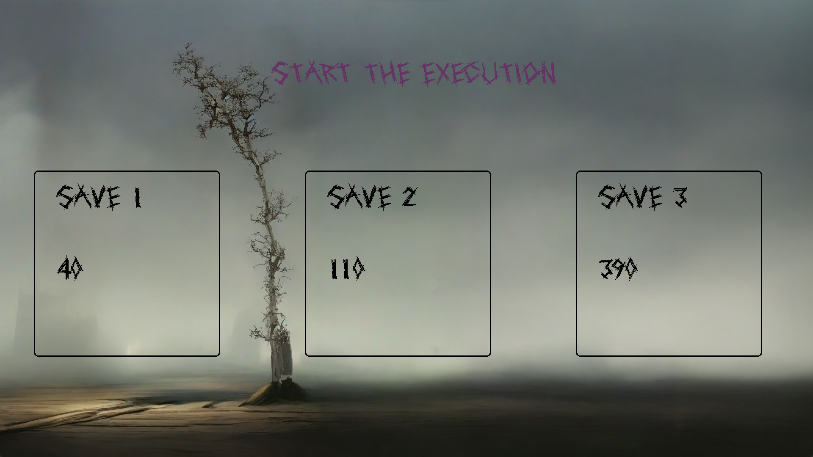
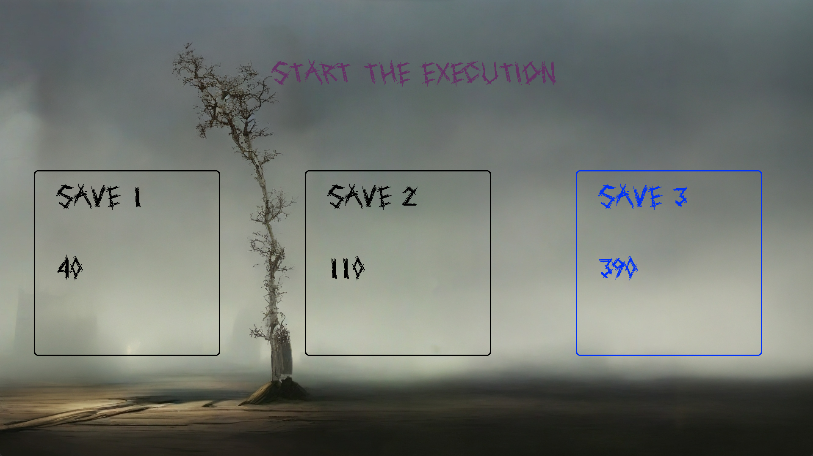
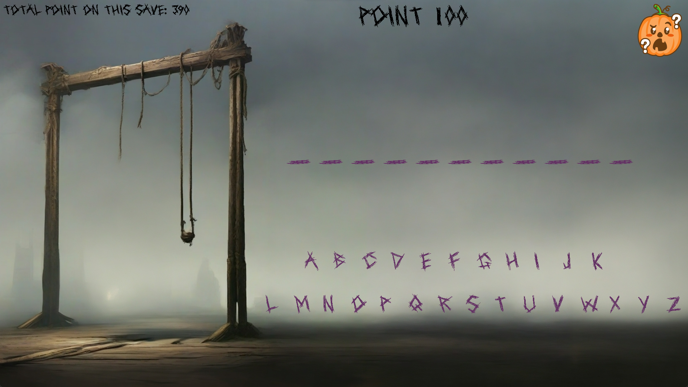
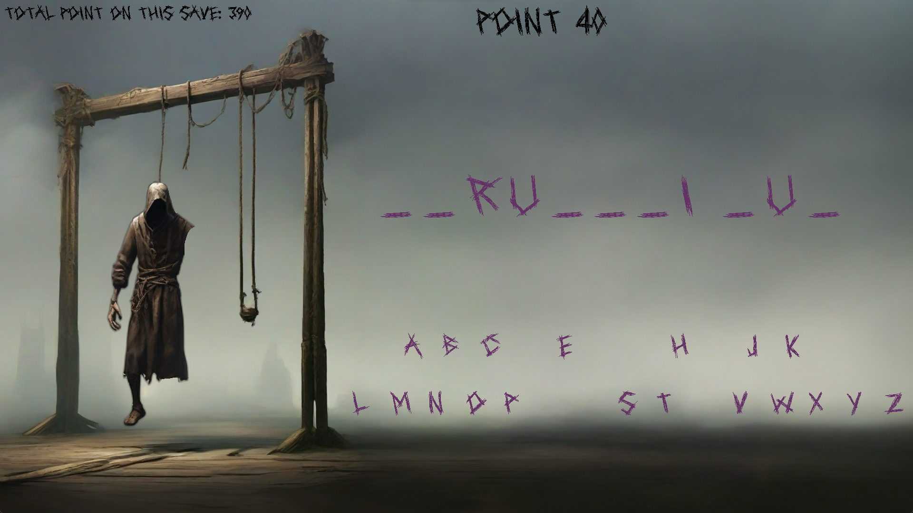
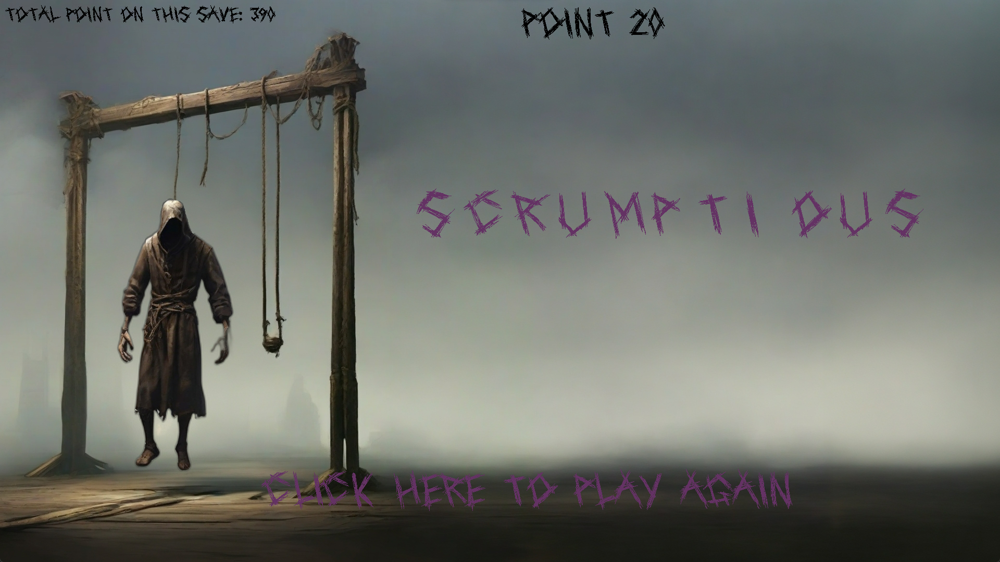

I made a Hangman game that you can guess words.

I used Python, pygame Leonardo.ai and Openai
I merge the fun game of hangman and LLM ai to play endlessly this game.

Here you can choose game mode between AI or Database that i created.

And You can choose the hardness of the word. It is based on AI decision so it can surprise you.

